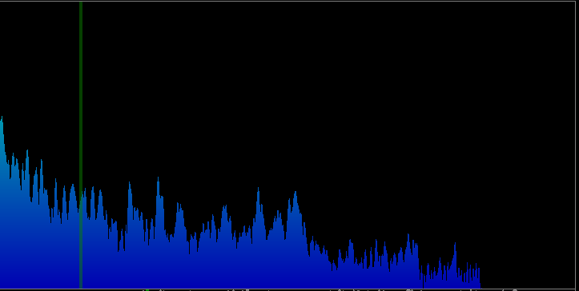

**Audio Visualizer by Jaimin Patel**

*Overview*

This application loads in an audio file and displays to the user a Spectrograph and a Waveform Graph while playing back the file. 

*How to Use*

1. Import an audio file to the "assets" folder. 
2. Edit the configuration of audio-visualizer and put the filename of your audio track in the program arguments in quotations. 
3. Press run! 
4. Controls: use the space-bar or mouse click to play and stop playback. 

*Spectrograph*

A spectrograph is a histogram that displays the relative weights (based on decibel level) of frequencies of an audio track at a given snapshot. Within this spectrograph, there is a Spectral Centroid, which highlights the weighted average of the frequency weights (the "center of mass"), and is represented by a rectangle that moves accordingly.

*Waveform Graph*

A waveform graph shows the volume of the audio track at each given frame. From these, one can see how loud or soft a given section will be, and can also visualize dynamic range (the contrast between loud and soft sections). 

